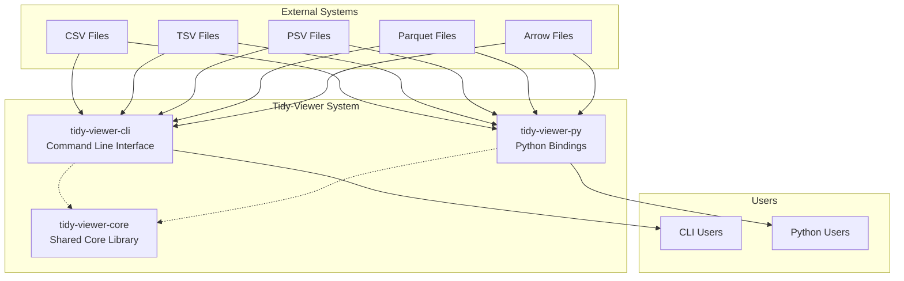
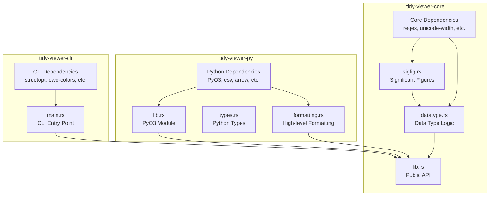

# Contributing to Tidy-Viewer

Thank you for your interest in contributing to Tidy-Viewer! This document provides a comprehensive guide to understanding the codebase structure, development workflow, and contribution guidelines.

## Table of Contents

- [Repository Structure](#repository-structure)
- [Architecture Overview](#architecture-overview)
- [Development Setup](#development-setup)
- [Development Workflow](#development-workflow)
- [Testing Guidelines](#testing-guidelines)
- [Documentation](#documentation)
- [Code Style](#code-style)
- [Release Process](#release-process)

## Repository Structure

Tidy-Viewer is organized as a **Cargo workspace** with three main crates:

```
tv/
├── Cargo.toml                 # Workspace root configuration
├── tidy-viewer-core/          # Shared core library
│   ├── Cargo.toml            # Core crate dependencies
│   └── src/
│       ├── lib.rs            # Public API exports
│       ├── datatype.rs       # Data type inference & formatting
│       └── datatype/
│           └── sigfig.rs     # Significant figure logic
├── tidy-viewer-cli/           # Command-line interface
│   ├── Cargo.toml            # CLI dependencies
│   └── src/
│       └── main.rs           # CLI entry point
└── tidy-viewer-py/            # Python bindings (PyO3)
    ├── Cargo.toml            # Python crate dependencies
    ├── pyproject.toml        # Python package configuration
    └── src/
        ├── lib.rs            # PyO3 module definition
        ├── types.rs          # Python-specific types
        └── formatting.rs     # High-level formatting
```

## Architecture Overview

### System Context Diagram



### Container Diagram



### Component Diagram

```mermaid
graph TB
    subgraph "tidy-viewer-core Components"
        FORMAT_STRINGS[format_strings<br/>String formatting]
        CALC_WIDTH[calculate_column_width<br/>Width calculation]
        IS_NA[is_na<br/>NA detection]
        IS_NEG[is_negative_number<br/>Negative number detection]
        PARSE_DELIM[parse_delimiter<br/>Delimiter parsing]
        INFER_TYPE[infer_type_from_string<br/>Type inference]
        GET_COL_TYPE[get_col_data_type<br/>Column type analysis]
        SIGFIG[get_final_string<br/>Significant figure formatting]
    end
    
    subgraph "tidy-viewer-cli Components"
        MAIN[main function<br/>CLI entry point]
        ARGS[Argument parsing<br/>structopt]
        FILE_READ[File reading<br/>csv, parquet, arrow]
        OUTPUT[Output formatting<br/>owo-colors]
    end
    
    subgraph "tidy-viewer-py Components"
        PY_FORMAT_DATA[format_data<br/>Python data formatting]
        PY_FORMAT_CSV[format_csv<br/>CSV file formatting]
        PY_FORMAT_PARQUET[format_parquet<br/>Parquet formatting]
        PY_FORMAT_ARROW[format_arrow<br/>Arrow formatting]
        PY_OPTIONS[PyFormatOptions<br/>Python options class]
    end
    
    MAIN --> FORMAT_STRINGS
    MAIN --> CALC_WIDTH
    MAIN --> IS_NA
    MAIN --> IS_NEG
    MAIN --> PARSE_DELIM
    MAIN --> INFER_TYPE
    MAIN --> GET_COL_TYPE
    MAIN --> SIGFIG
    
    PY_FORMAT_DATA --> FORMAT_STRINGS
    PY_FORMAT_DATA --> CALC_WIDTH
    PY_FORMAT_DATA --> IS_NA
    PY_FORMAT_DATA --> IS_NEG
    
    PY_FORMAT_CSV --> FORMAT_STRINGS
    PY_FORMAT_CSV --> CALC_WIDTH
    PY_FORMAT_CSV --> IS_NA
    PY_FORMAT_CSV --> IS_NEG
    
    PY_FORMAT_PARQUET --> FORMAT_STRINGS
    PY_FORMAT_PARQUET --> CALC_WIDTH
    PY_FORMAT_PARQUET --> IS_NA
    PY_FORMAT_PARQUET --> IS_NEG
    
    PY_FORMAT_ARROW --> FORMAT_STRINGS
    PY_FORMAT_ARROW --> CALC_WIDTH
    PY_FORMAT_ARROW --> IS_NA
    PY_FORMAT_ARROW --> IS_NEG
```



## Development Setup

### Prerequisites

- **Rust**: Latest stable version (1.70+)
- **Python**: 3.8+ (for Python bindings development)
- **uv**: Python package manager (recommended)

### Initial Setup

1. **Clone the repository**:
   ```bash
   git clone https://github.com/alexhallam/tv.git
   cd tv
   ```

2. **Build all crates**:
   ```bash
   cargo build --workspace
   ```

3. **Run tests**:
   ```bash
   cargo test --workspace
   ```

4. **Build Python bindings** (optional):
   ```bash
   cd tidy-viewer-py
   uv pip install .
   ```

### Development Environment

The project uses several development tools:

- **Rust**: Primary language for core logic and CLI
- **PyO3**: Python bindings framework
- **maturin**: Python package building tool
- **uv**: Python dependency management

## Development Workflow

### Making Changes

1. **Create a feature branch**:
   ```bash
   git checkout -b feature/your-feature-name
   ```

2. **Make your changes** following the [Code Style](#code-style) guidelines

3. **Test your changes**:
   ```bash
   # Test Rust crates
   cargo test --workspace
   
   # Test Python bindings
   cd tidy-viewer-py
   uv run pytest
   ```

4. **Build and verify**:
   ```bash
   # Build CLI
   cargo build --release --bin tidy-viewer
   
   # Build Python package
   cd tidy-viewer-py
   uv run maturin build
   ```

### Code Organization Principles

- **Single Source of Truth**: Core logic lives in `tidy-viewer-core`
- **Separation of Concerns**: CLI handles I/O, Python handles Python-specific logic
- **Shared Dependencies**: Common dependencies defined in workspace root
- **Consistent APIs**: All crates use the same core functions

### Common Development Tasks

#### Adding a New Data Type

1. **Add detection logic** in `tidy-viewer-core/src/datatype.rs`
2. **Add formatting logic** in the same file
3. **Add tests** to verify behavior
4. **Update documentation** in `tidy-viewer-core/src/lib.rs`

#### Adding a New File Format

1. **Add parsing logic** in the appropriate crate (`cli` or `py`)
2. **Use core formatting functions** from `tidy-viewer-core`
3. **Add tests** for the new format
4. **Update documentation**

#### Modifying Formatting Logic

1. **Make changes** in `tidy-viewer-core/src/datatype.rs`
2. **Update tests** to reflect changes
3. **Verify CLI and Python outputs** remain consistent
4. **Update documentation**

## Testing Guidelines

### Rust Testing

- **Unit tests**: Inline with code in each module
- **Integration tests**: In `tests/` directories
- **Workspace tests**: Run with `cargo test --workspace`

### Python Testing

- **Unit tests**: In `tidy-viewer-py/tests/`
- **Integration tests**: Test Python bindings functionality
- **Parity tests**: Ensure Python and CLI outputs match

### Test Coverage

- **Core functions**: 100% test coverage for `tidy-viewer-core`
- **CLI functionality**: Test all command-line options
- **Python bindings**: Test all public Python functions
- **Cross-format consistency**: Ensure CSV, TSV, Parquet outputs are consistent

### Running Tests

```bash
# All Rust tests
cargo test --workspace

# Specific crate tests
cargo test -p tidy-viewer-core
cargo test -p tidy-viewer-cli

# Python tests
cd tidy-viewer-py
uv run pytest

# Parity tests
python test_output_parity.py
```

## Documentation

### Rust Documentation

Generate and view Rust documentation:

```bash
# Generate docs for core crate
cargo doc -p tidy-viewer-core --open

# Generate docs for all crates
cargo doc --workspace --open
```

### Python Documentation

The Python bindings include:
- **Docstrings**: All public functions have Python docstrings
- **Type hints**: Full type annotation support
- **Examples**: Usage examples in docstrings

### Documentation Standards

- **Rust**: Use rustdoc comments (`///` and `//!`)
- **Python**: Use Google-style docstrings
- **Architecture**: Use Mermaid diagrams for system design
- **API**: Include examples for all public functions

## Code Style

### Rust Style

- Follow [Rust Style Guide](https://doc.rust-lang.org/1.0.0/style/style/naming/README.html)
- Use `rustfmt` for formatting
- Use `clippy` for linting

### Python Style

- Follow PEP 8
- Use type hints
- Use `black` for formatting
- Use `mypy` for type checking

### General Guidelines

- **Descriptive names**: Use clear, descriptive variable and function names
- **Comments**: Explain complex logic, not obvious code
- **Error handling**: Use proper error types and messages
- **Performance**: Consider performance implications of changes

## Release Process

### Version Management

- **Semantic versioning**: Follow semver for all crates
- **Workspace coordination**: All crates should be released together
- **Changelog**: Update `CHANGELOG.md` for all releases

### Release Steps

1. **Update versions** in all `Cargo.toml` files
2. **Update changelog** with new features and fixes
3. **Run full test suite** to ensure everything works
4. **Build release artifacts**:
   ```bash
   cargo build --release --workspace
   cd tidy-viewer-py && uv run maturin build
   ```
5. **Create GitHub release** with artifacts
6. **Publish to crates.io** (if applicable)

### Pre-release Checklist

- [ ] All tests pass
- [ ] Documentation is up to date
- [ ] Changelog is updated
- [ ] Version numbers are consistent
- [ ] Release artifacts build successfully
- [ ] Python package builds successfully

## Getting Help

- **Issues**: Use GitHub Issues for bug reports and feature requests
- **Discussions**: Use GitHub Discussions for questions and ideas
- **Code Review**: All changes require review before merging
- **Documentation**: Check existing docs before asking questions

## Contributing Guidelines

### Before Contributing

1. **Check existing issues** to avoid duplicates
2. **Read the documentation** to understand the codebase
3. **Test your changes** thoroughly
4. **Follow the code style** guidelines

### Pull Request Process

1. **Fork the repository**
2. **Create a feature branch**
3. **Make your changes**
4. **Add tests** for new functionality
5. **Update documentation** as needed
6. **Submit a pull request** with clear description

### Review Process

- **Automated checks** must pass
- **Code review** required from maintainers
- **Documentation updates** may be requested
- **Test coverage** should be maintained or improved

Thank you for contributing to Tidy-Viewer! 🎉
