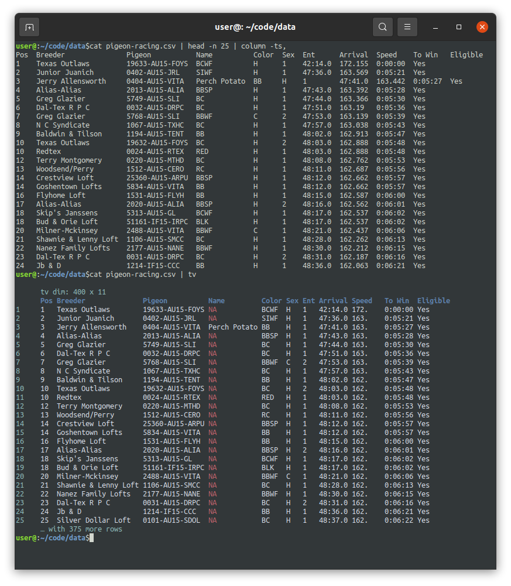
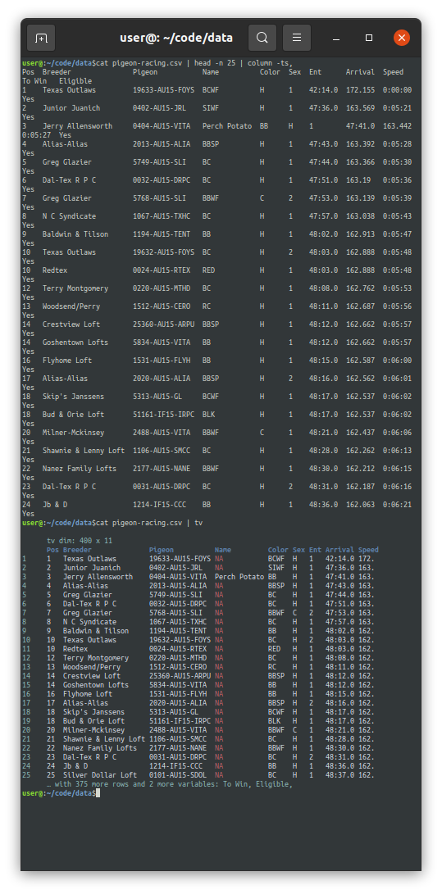

[](https://github.com/alexhallam/tv/actions/workflows/rust.yml)
[](https://crates.io/crates/tidy-viewer)

<h1 align="center">Tidy Viewer (tv)</h1>
<p align="center">Tidy Viewer (tv) is a csv pretty printer that uses column styling to maximize viewer enjoyment.</p>


# Pretty Printing

[](https://asciinema.org/a/NUlqhMkFLyfxCeU6mea7YuHHX)

# Installation

### 1. Cargo Install

The following will install from the [crates.io](https://crates.io/crates/tidy-viewer) source. For convenience add the alas `alias tv='tidy-viewer'` to bashrc.

```sh
cargo install tidy-viewer
sudo cp /home/ubuntu/.cargo/bin/tidy-viewer /usr/local/bin/.
echo "alias tv='tidy-viewer'" >> ~/.bashrc
source ~/.bashrc
```

### 2. Install from source

The current version is alpha. I do not plan to push to crates.io until this is more polished. If you would like to try this in its raw state [install rust](https://www.rust-lang.org/tools/install) and follow the steps below.

1. Clone repo
2. `cargo build --release`
3. cp binary to `bin`
4. Add `alias tv='tidy-viewer'` to `~/.bashrc`

```sh
git clone https://github.com/alexhallam/tv
cd tv
cargo build --release
sudo cp ./target/release/tv /usr/local/bin/.
echo "alias tv='tidy-viewer'" >> ~/.bashrc
source ~/.bashrc
```

# Example

```sh
# Download the diamonds data
wget https://raw.githubusercontent.com/tidyverse/ggplot2/master/data-raw/diamonds.csv

# pipe 35 records to tv
cat diamonds.csv | head -n 35 | tv
```

# Significant Figure Definitions & Rules

[](https://asciinema.org/a/YvXpj0faFX91ahr2URMq0ZbBj)

> The first three digits. The first three digits represent > 99.9% the value of a number. -- GNU-R Pillar

`tv` uses the same significant figure (sigfig) rules that the R package `pillar` uses.

The purpose of the sigfig rules in `tv` is to guide the eye to the most important information in a number. This section defines terms and the decision tree used in the calculation of the final value displayed.

## Definitions

```text
     ┌─────┐      ┌─────┐     ─┐
     │     │      │     │      │
     │     │      │     │      │
     │     │      │     │      │
     │     │      │     │      │
     │     │  ┌┐  │     │      │
     └─────┘  └┘  └─────┘    ──┴─
   │        │    │                │
   └────────┘  ▲ └────────────────┘
left hand side │  right hand side
     (lhs)     │       (rhs)

            decimal
```

**left hand side (lhs)**: digits on the left hand side of the decimal.

**right hand side (rhs)**: digits on the right hand side of the decimal.

```text

 ┌─────┐      ┌─────┐     ─┐     ┌─────┐
 │     │      │     │      │     │     │
 │     │      │     │      │     │     │
 │     │      │     │      │     │     │
 │     │      │     │      │     │     │
 │     │  ┌┐  │     │      │     │     │
 └─────┘  └┘  └─────┘    ──┴─    └─────┘

│                     │         │       │
└─────────────────────┘         └───────┘
       leading 0s              trailing 0s
```
**leading 0s**: 0s to the left of a non-zero.

**trailing 0s**: 0s to the right of a non-zero. The zeros in 500m are trailing as well as the 0s in 0.500km. 


```text
 ─┐     ┌─────┐       ─┐
  │     │     │        │
  │     │     │        │
  │     │     │        │
  │     │     │        │
  │     │     │  ┌┐    │
──┴─    └─────┘  └┘  ──┴─

                   │        │
                   └────────┘
              fractional digit(s)
```

**fractional digits**: Digits on the rhs of the decimal. The represent the non-integer part of a number.

## Rules

There are only 4 outputs possible. The significant figures to display are set by the user. Assume `sigfig = 3`:

1. **lhs only (`12345.0 -> 12345`)**: If no fractional digits are present and lhs >= sigfig then return lhs
2. **lhs + point (`1234.5 -> 1234.`)**: If fractional digits are present and lhs >= sigfig then return lhs with point. This is to let the user know that some decimal dust is beyond the main mass of the number.
3. **lhs + point + rhs (`1.2345 -> 1.23`)**: If fractional digits are present and lhs < sigfig return the first three digits of the number.
4. **long rhs (`0.00001 -> 0.0001`)**: This is reserved for values with leading 0s in the rhs.


```text
# Psuedo Code: Sigfig logic assuming sigfig = 3
if lhs == 0:
    //n = ((floor(log10(abs(x))) + 1 - sigfig)
    //r =(10^n) * round(x / (10^n))
    //return r
    // (0.12345 -> 0.123)
else:
    if log10(lhs) + 1 > sigfig:
        if rhs > 0:
            //concatonate:
            //(lhs)
            //(point)
            //(123.45 -> 123.)
            //(123.45 -> 123.)
        else:
            //concatonate:
            //(lhs)
            //(1234.0 -> 1234)
            //(100.0 -> 100)
    else:
        //concatonate:
        //(lhs)
        //(point)
        //sigfig - log10(lhs) from rhs
        //(12.345 -> 12.3)
        //(1.2345 -> 1.23)
```

# Tools to pair with tv

`tv` is a good compliment to command line data manipulation tools. I have listed some tools that I like to use with tv.

[xsv](https://github.com/BurntSushi/xsv) - Command line csv data manipulation. Rust

[csvtk](https://bioinf.shenwei.me/csvtk/) - Command line csv data manipulation. Go

[tsv-utils](https://github.com/eBay/tsv-utils) - Command line csv data manipulation toolkit. D

[q](https://github.com/zestyping/q) - Command line csv data manipulation query-like. Python

[miller](https://github.com/johnkerl/miller) - Commane line data manipulaiton, statistics, and more. C

[xsv](https://github.com/BurntSushi/xsv) - a command line program for indexing, slicing, analyzing, splitting and joining CSV files

[tsv-utils](https://github.com/eBay/tsv-utils) - command line utilities for tabular data files

[q](https://github.com/zestyping/q) - q is a command line tool that allows direct execution of SQL-like queries on CSVs/TSVs 

[miller](https://github.com/johnkerl/miller) - Miller is like awk, sed, cut, join, and sort for data formats such as CSV, TSV, tabular JSON and positionally-indexed.

# Tools similar to tv

`column` Comes standard with linux. To get similar functionality run `column file.csv -ts,`

Though `column` is similar I do think there are some reasons `tv` is a better tool.

## 1. NA comprehension

`NA` values very important! Viewers should have their attention drawn to these empty cells. In the image below `NA` values are not only invisible, but it seems to be causing incorrect alignment in other columns.



## 2. Column Overflow Logic

In cases where the terminal width can't fit all of the columns in a dataframe, column will try to smush data on the rows below. This results in an unpleasant viewing experience. 

`tv` can automatically tell when there will be too many columns to print. When this occurs it will only print the columns that fit in the terminal and mention the extras in the footer below the table.



# Inspiration

[pillar](https://pillar.r-lib.org/dev/articles/digits.html#trailing-dot-1) - R's tibble like formatting. Fantastic original work by [Kirill Müller](https://github.com/krlmlr) and [Hadley Wickham](http://hadley.nz/). `tv` makes an atempt to port their ideas to the terminal.

