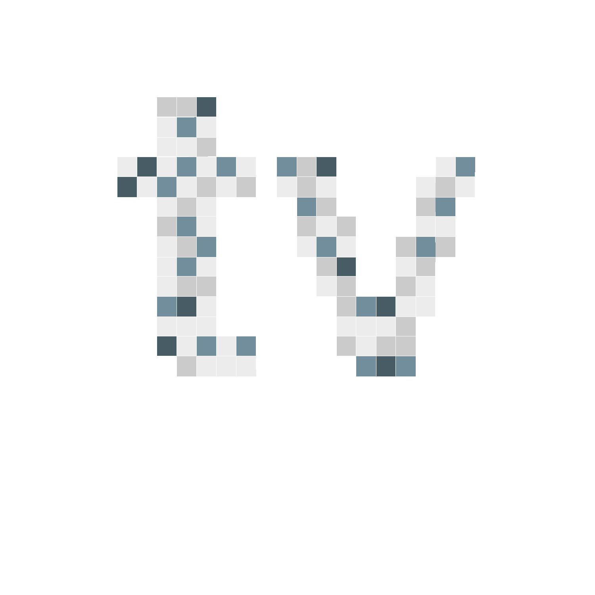
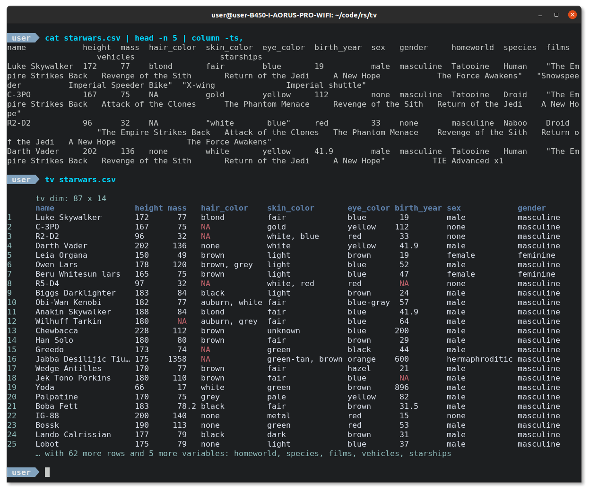
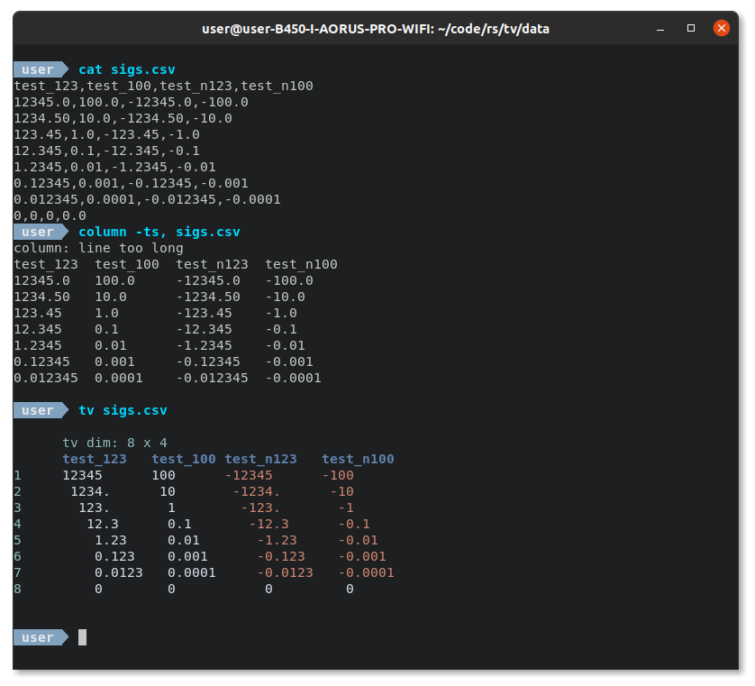
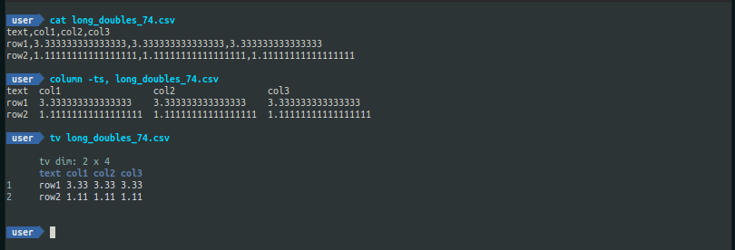
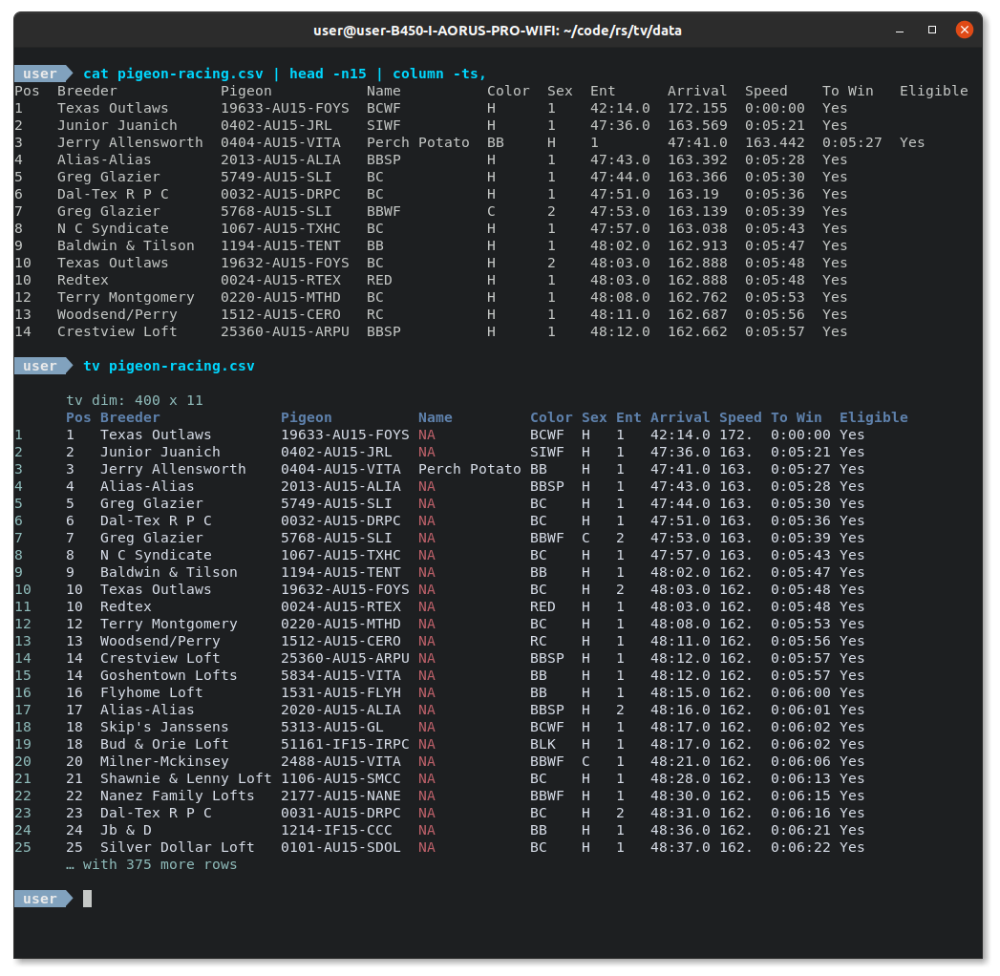
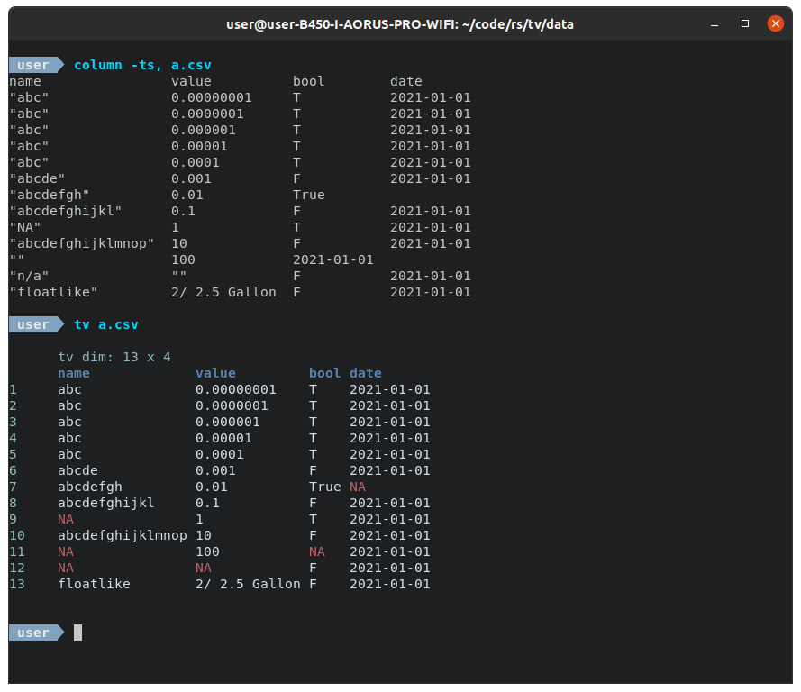
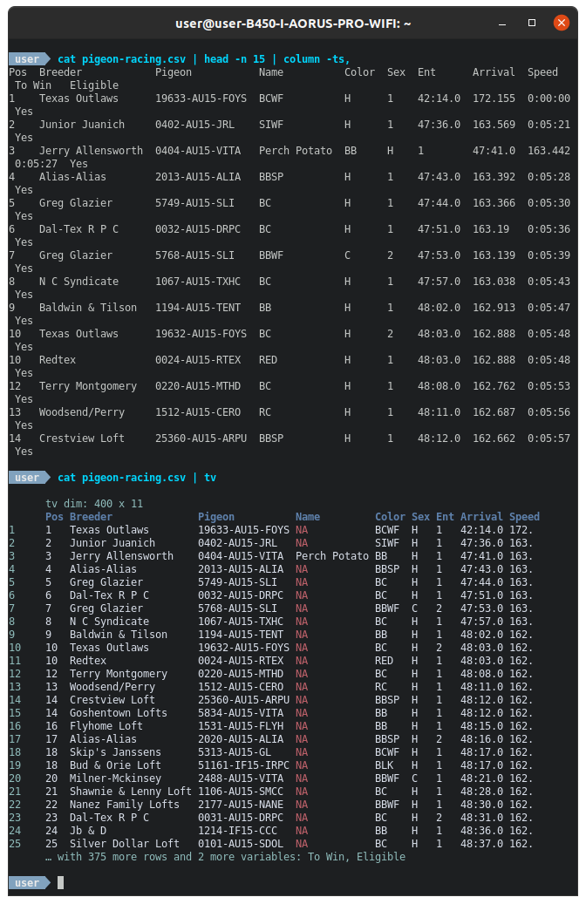

[](https://github.com/alexhallam/tv/actions/workflows/rust.yml)
[](https://crates.io/crates/tidy-viewer)


<h1 align="center">Tidy Viewer (tv)</h1>
<p align="center">Tidy Viewer (tv) is a cross-platform csv pretty printer that uses column styling to maximize viewer enjoyment.</p>



# Pretty Printing



# Contents
* [Features](#features)
* [Installation](#installation)
* [Examples](#examples)
* [Significant Figure Definitions & Rules](#significant-figure-definitions-and-rules)
* [Tools to pair with `tv`](#tools-to-pair-with-tv)
* [Configuration Dotfile](#configuration-dotfile) (Coming Soon!)
* [Help](#help)
* [Inspiration](#inspiration)

# Features

1. Nice colors out of the box
2. Significant digit printing (no more decimal dust taking valuable terminal space)
3. NA comprehension and coloring (no more misaligned data cells due to missing data)
4. Dimensions printed first (no more guessing how many rows and columns are in the data)
5. Column overflow logic (no more misalignment due to terminal dimensions)
6. Long string/Unicode truncation (no more long strings pushing other data around)
7. Customizable with a dotfile config (bring your own theme)

# Installation

The following install options are available via package managers:

* [Cargo](#cargo)
* [Debian](#debian)
* [AUR](#aur)
* [Snap](#snap)
* [Homebrew](#homebrew)

We currently cut releases for the following architectures. Download from the [release page](https://github.com/alexhallam/tv/releases).

* **MacOS**
* **ARM**
* **Windows**
* **Build from source (Most general)**

The instructions for all of the above are very similar with the following general steps.

1. Download your desired release from the [release page](https://github.com/alexhallam/tv/releases)
2. `tar -xvzf <RELEASE_FILE_NAME>`
3. `cd` into uncompressed folder
4. Find binary `tidy-viewer`

After the above steps I would highly recommend you make an alias for `tidy-viewer` as shown for other builds.

### Cargo

The following will install from the [crates.io](https://crates.io/crates/tidy-viewer) source. For convenience add the alas `alias tv='tidy-viewer'` to `.bashrc`.

```sh
cargo install tidy-viewer
sudo cp /home/$USER/.cargo/bin/tidy-viewer /usr/local/bin/.
echo "alias tv='tidy-viewer'" >> ~/.bashrc
source ~/.bashrc
```

### Debian

The below instructions work with the most recent release `<VERSION>` found here [release page](https://github.com/alexhallam/tv/releases).

```sh
wget https://github.com/alexhallam/tv/releases/download/<VERSION>/tidy-viewer_<VERSION>_amd64.deb
sudo dpkg -i tidy-viewer_<VERSION>_amd64.deb
echo "alias tv='tidy-viewer'" >> ~/.bashrc
source ~/.bashrc
```

### AUR

Kindly maintained by @yigitsever

```sh
paru -S tidy-viewer
```

### Snap

```
sudo snap install --edge tidy-viewer
```

### Homebrew

```
brew install tidy-viewer
```

# Examples

Have some fun with the following datasets!

### Diamonds
```sh
# Download the diamonds data
wget https://raw.githubusercontent.com/tidyverse/ggplot2/master/data-raw/diamonds.csv

# pipe to tv
cat diamonds.csv | tv
```

### Starwars
```sh
wget https://raw.githubusercontent.com/tidyverse/dplyr/master/data-raw/starwars.csv

# Pass as agrument
tv starwars.csv
```

### Pigeon Racing
```sh
wget https://raw.githubusercontent.com/joanby/python-ml-course/master/datasets/pigeon-race/pigeon-racing.csv
cat pigeon-racing.csv | tv
```

### Titanic
```sh
wget https://raw.githubusercontent.com/datasciencedojo/datasets/master/titanic.csv
# send to pager with color
# less 
tv titanic.csv -ea | less -R
# bat
tv titanic.csv -a -n 1000 | bat -p
```

# Significant Figure Definitions And Rules





> The first three digits represent > 99.9% the value of a number. -- GNU-R Pillar

Choosing the sigfigs amounts to how much of the value of a number is desired. The table below shows an example calculation with variable sigfigs.

| sigfigs | value  | sigfiged_value | %value_of_the_number_explained_by_sigfiged_vale |
|---------|--------|----------------|:-----------------------------------------------:|
| 1       | 0.1119 | 0.1            |                       >89%                      |
| 2       | 0.1119 | 0.11           |                       >98%                      |
| 3       | 0.1119 | 0.111          |                       >99%                      |

`tv` uses the same significant figure (sigfig) rules that the R package `pillar` uses.

The purpose of the sigfig rules in `tv` is to guide the eye to the most important information in a number. This section defines terms and the decision tree used in the calculation of the final value displayed.

## Definitions

```text
     ┌─────┐      ┌─────┐     ─┐
     │     │      │     │      │
     │     │      │     │      │
     │     │      │     │      │
     │     │      │     │      │
     │     │  ┌┐  │     │      │
     └─────┘  └┘  └─────┘    ──┴─
   │        │    │                │
   └────────┘  ▲ └────────────────┘
left hand side │  right hand side
     (lhs)     │       (rhs)

            decimal
```

**left hand side (lhs)**: digits on the left hand side of the decimal.

**right hand side (rhs)**: digits on the right hand side of the decimal.

```text

 ┌─────┐      ┌─────┐     ─┐     ┌─────┐
 │     │      │     │      │     │     │
 │     │      │     │      │     │     │
 │     │      │     │      │     │     │
 │     │      │     │      │     │     │
 │     │  ┌┐  │     │      │     │     │
 └─────┘  └┘  └─────┘    ──┴─    └─────┘

│                     │         │       │
└─────────────────────┘         └───────┘
       leading 0s              trailing 0s
```
**leading 0s**: 0s to the left of a non-zero.

**trailing 0s**: 0s to the right of a non-zero. The zeros in 500m are trailing as well as the 0s in 0.500km. 


```text
 ─┐     ┌─────┐       ─┐
  │     │     │        │
  │     │     │        │
  │     │     │        │
  │     │     │        │
  │     │     │  ┌┐    │
──┴─    └─────┘  └┘  ──┴─

                   │        │
                   └────────┘
              fractional digit(s)
```

**fractional digits**: Digits on the rhs of the decimal. The represent the non-integer part of a number.

## Rules

There are only 4 outputs possible. The significant figures to display are set by the user. Assume `sigfig = 3`:

1. **lhs only (`12345.0 -> 12345`)**: If no fractional digits are present and lhs >= sigfig then return lhs
2. **lhs + point (`1234.5 -> 1234.`)**: If fractional digits are present and lhs >= sigfig then return lhs with point. This is to let the user know that some decimal dust is beyond the main mass of the number.
3. **lhs + point + rhs (`1.2345 -> 1.23`)**: If fractional digits are present and lhs < sigfig return the first three digits of the number.
4. **long rhs (`0.00001 -> 0.00001`)**: This is reserved for values with leading 0s in the rhs.


```text
# Psuedo Code: Sigfig logic assuming sigfig = 3
if lhs == 0:
    n = ((floor(log10(abs(x))) + 1 - sigfig)
    r =(10^n) * round(x / (10^n))
    return r
    // (0.12345 -> 0.123)
else:
    if log10(lhs) + 1 > sigfig:
        if rhs > 0:
            //concatenate:
            //(lhs)
            //(point)
            //(123.45 -> 123.)
        else:
            //concatenate:
            //(lhs)
            //(1234.0 -> 1234)
            //(100.0 -> 100)
    else:
        //concatenate:
        //(lhs)
        //(point)
        //sigfig - log10(lhs) from rhs
        //(12.345 -> 12.3)
        //(1.2345 -> 1.23)
```

# Tools to pair with tv

`tv` is a good complement to command line data manipulation tools. I have listed some tools that I like to use with tv.

[xsv](https://github.com/BurntSushi/xsv) - Command line csv data manipulation. [Rust | CLI]

[csvtk](https://bioinf.shenwei.me/csvtk/) - Command line csv data manipulation. [Go | CLI]

[tsv-utils](https://github.com/eBay/tsv-utils) - Command line csv data manipulation toolkit. [D | CLI]

[q](https://github.com/zestyping/q) - Command line csv data manipulation query-like. [Python | CLI]

[miller](https://github.com/johnkerl/miller) - Command line data manipulation, statistics, and more. [C | CLI]

[VisiData](https://www.visidata.org/) - An interactive terminal user interface that is built to explore and wrangle data. [Python | TUI]

# Tools similar to tv

`column` Comes standard with Linux. To get similar functionality run `column file.csv -ts,`

Though `column` is similar I do think there are some reasons `tv` is a better tool.

## 1. NA comprehension

`NA` values are very important! Viewers should have their attention drawn to these empty cells. In the image below `NA` values are not only invisible, but it seems to be causing incorrect alignment in other columns.



There are many ways that programs will designate missing values. Some use `none`, others use `NaN`, and many more `""`, `NA`, `null`, `n/a` etc. `tv` searches for these strings and replaces them with `NA`. This is similar in spirit to the significant digit calculations and the truncation of columns with long strings. The purpose of `tv` is not to show the complete literal value, but to guide the eye.



## 2. Column Overflow Logic

In cases where the terminal width can't fit all of the columns in a dataframe, column will try to smush data on the rows below. This results in an unpleasant viewing experience. 

`tv` can automatically tell when there will be too many columns to print. When this occurs it will only print the columns that fit in the terminal and mention the extras in the footer below the table.



# Configuration Dotfile

For information on dotfile configuration see `tv --help`. This allows users to set their own color palette, rows to print, max column width, etc.

# Help

`tv --help`

```txt
tv 1.4.4
Tidy Viewer (tv) is a csv pretty printer that uses column styling to maximize viewer enjoyment.✨✨📺✨✨

    Example Usage:
    wget https://raw.githubusercontent.com/tidyverse/ggplot2/master/data-raw/diamonds.csv
    cat diamonds.csv | head -n 35 | tv

    Configuration File Support:
    An example config is printed to make it easy to copy/paste to `tv.toml`.
    The config (tv.toml) location is dependent on OS:
        * Linux: $XDG_CONFIG_HOME or $HOME/.config/tv.toml
        * macOS: $HOME/Library/Application Support/tv.toml
        * Windows: {FOLDERID_RoamingAppData}\tv.toml

        ## ==Tidy-Viewer Config Example==
        ## Remove the first column of comments for valid toml file
        ## The delimiter separating the columns. [default: ,]
        #delimiter = ","
        ## Add a title to your tv. Example 'Test Data' [default: NA ("")]
        #title = ""
        ## Add a footer to your tv. Example 'footer info' [default: NA ("")]
        #footer = ""
        ## The upper (maximum) width of columns. [default: 20]
        #upper_column_width = 20
        ## The minimum width of columns. Must be 2 or larger. [default: 2]
        #lower_column_width = 2
        ## head number of rows to output <row-display> [default: 25]
        #number = 35
        ## extend rows beyond term width (do not trucate) [default: false]
        # extend_rows = true
        ## meta_color = [R,G,B] color for row index and "tv dim: rowsxcols"
        #meta_color = [64, 179, 162]
        ## header_color = [R,G,B] color for column headers
        #header_color = [232, 168, 124]
        ## std_color = [R,G,B] color for standard cell data values
        #std_color = [133, 205, 202]
        ## na_color = [R,G,B] color for NA values
        #na_color = [226, 125, 95]
        ## neg_num_color = [R,G,B] color for negative values
        #neg_num_color = [226, 125, 95]

USAGE:
    tidy-viewer [FLAGS] [OPTIONS] [FILE]

FLAGS:
    -d, --debug-mode      Print object details to make it easier for the maintainer to find and resolve bugs.
    -e, --extend-rows     Extended row beyond term width (do not truncate). Useful with `less -S`.
    -a, --color-always    Always force color output. Example `tv -a starwars.csv | less -R` or `tv -a starwars.csv | bat
                          -p`. The `less` cli has the `-R` flag to parse colored output.
    -h, --help            Prints help information
    -V, --version         Prints version information

OPTIONS:
    -c, --color <color>
            There are 5 preconfigured color palettes:
                            (1)nord
                            (2)one_dark
                            (3)gruvbox
                            (4)dracula
                            (5)uncolor (Coming Soon)
            An input of (5)uncolor will remove color properties. Note that colors will make it difficult to pipe output
            to other utilities.The default value of (0) is reserved to make config/option coloring logic easier.
            [default: 0]
    -s, --delimiter <delimiter>                      The delimiter separating the columns.
    -f, --footer <footer>                            Add a footer to your tv. Example 'footer info' [default: NA]
    -l, --lower-column-width <lower-column-width>
            The lower (minimum) width of columns. Must be 2 or larger. [default: 2]

    -n, --number of rows to output <row-display>     Show how many rows to display. [default: 25]
    -g, --sigfig <sigfig>                            Significant Digits. Default 3. Max is 7 [default: 3]
    -t, --title <title>                              Add a title to your tv. Example 'Test Data' [default: NA]
    -u, --upper-column-width <upper-column-width>    The upper (maximum) width of columns. [default: 20]

ARGS:
    <FILE>    File to process
```
# Inspiration

[pillar](https://pillar.r-lib.org/dev/articles/digits.html#trailing-dot-1) - R's tibble like formatting. Fantastic original work by [Kirill Müller](https://github.com/krlmlr) and [Hadley Wickham](http://hadley.nz/). `tv` makes an attempt to port their ideas to the terminal.
