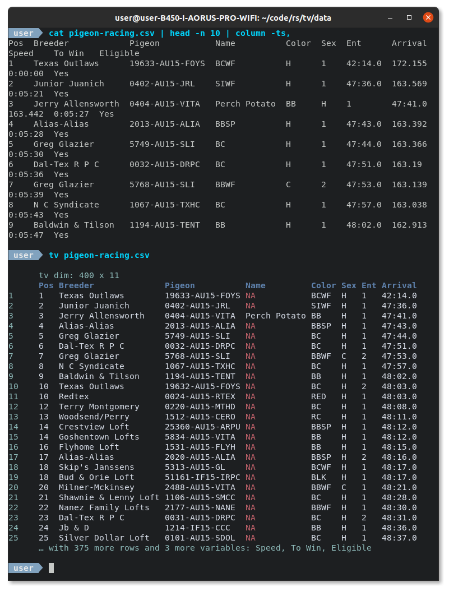

[](https://github.com/alexhallam/tv/actions/workflows/rust.yml)
[](https://crates.io/crates/tidy-viewer)


[](https://snapcraft.io/tidy-viewer)

<h1 align="center">Tidy Viewer (tv)</h1>
<p align="center">Tidy Viewer (tv) is a cross-platform data pretty printer that uses column styling to maximize viewer enjoyment. Supports CSV, TSV, PSV, and Parquet files with intelligent streaming for large datasets.</p>


# Pretty Printing


# Contents
* [Features](#features)
* [Installation](#installation)
* [Examples](#examples)
* [Documentation](#documentation)
* [Significant Figure Definitions & Rules](#significant-figure-definitions-and-rules)
* [Tools to pair with `tv`](#tools-to-pair-with-tv)
* [Configuration Dotfile](#configuration-dotfile)
* [FAQ](#faq)
* [Help](#help)
* [Inspiration](#inspiration)

# Features

1. **Multi-format support**: CSV, TSV, PSV, and **Parquet files** 🎉
2. **Intelligent streaming**: Automatic memory-efficient loading for large files (>5MB) 🚀
3. Nice colors out of the box
4. Significant digit printing (no more decimal dust taking valuable terminal space)
5. NA comprehension and coloring (no more misaligned data cells due to missing data)
6. Dimensions printed first (no more guessing how many rows and columns are in the data)
7. Column overflow logic (no more misalignment due to terminal dimensions)
8. Long string/Unicode truncation (no more long strings pushing other data around)
9. Customizable with a dotfile config (bring your own theme)

# Installation

The following install options are available via package managers:

* [Cargo](#cargo)
* [Debian](#debian)
* [AUR](#aur)
* [Snap](#snap)
* [Homebrew](#homebrew)

We currently cut releases for the following architectures. Download from the [release page](https://github.com/alexhallam/tv/releases).

* **MacOS**
* **ARM**
* **Windows**
* **Build from source (Most general)**

The instructions for all of the above are very similar with the following general steps.

1. Download your desired release from the [release page](https://github.com/alexhallam/tv/releases)
2. `tar -xvzf <RELEASE_FILE_NAME>`
3. `cd` into uncompressed folder
4. Find binary `tidy-viewer`

After the above steps I would highly recommend you make an alias for `tidy-viewer` as shown for other builds.

# Documentation

📚 **Comprehensive documentation is available:**

- **[📖 API Documentation](https://docs.rs/tidy-viewer-core)** - Rust API reference with examples
- **[🏗️ Contributing Guide](CONTRIBUTING.md)** - Architecture overview and development guidelines
- **[🐍 Python Documentation](tidy-viewer-py/README.md)** - Python bindings usage and examples

## Architecture Overview

Tidy-Viewer is organized as a **Cargo workspace** with three main components:

- **`tidy-viewer-core`** - Shared core library with data type inference and formatting logic
- **`tidy-viewer-cli`** - Command-line interface for direct file processing  
- **`tidy-viewer-py`** - Python bindings using PyO3 for integration with Python workflows

This architecture ensures consistent behavior across all interfaces while maintaining clean separation of concerns.

### Cargo

The following will install from the [crates.io](https://crates.io/crates/tidy-viewer) source. For convenience add the alas `alias tv='tidy-viewer'` to `.bashrc`.

```sh
cargo install tidy-viewer
sudo cp /home/$USER/.cargo/bin/tidy-viewer /usr/local/bin/.
echo "alias tv='tidy-viewer'" >> ~/.bashrc
source ~/.bashrc
```

### Debian

The below instructions work with the most recent release `<VERSION>` found here [release page](https://github.com/alexhallam/tv/releases).

```sh
wget https://github.com/alexhallam/tv/releases/download/<VERSION>/tidy-viewer_<VERSION>_amd64.deb
sudo dpkg -i tidy-viewer_<VERSION>_amd64.deb
echo "alias tv='tidy-viewer'" >> ~/.bashrc
source ~/.bashrc
```

### AUR

Kindly maintained by @yigitsever

```sh
paru -S tidy-viewer
```

### Snap

```
sudo snap install --edge tidy-viewer
```

### Homebrew

```
brew install tidy-viewer
```

# Examples

Have some fun with the following datasets!

## CSV Data Examples

### Diamonds
```sh
# Download the diamonds data
wget https://raw.githubusercontent.com/tidyverse/ggplot2/master/data-raw/diamonds.csv

# pipe to tv
cat diamonds.csv | tv
```

### Starwars
```sh
wget https://raw.githubusercontent.com/tidyverse/dplyr/master/data-raw/starwars.csv

# Pass as argument
tv starwars.csv
```

### Pigeon Racing
```sh
wget https://raw.githubusercontent.com/joanby/python-ml-course/master/datasets/pigeon-race/pigeon-racing.csv
cat pigeon-racing.csv | tv
```

### Titanic
```sh
wget https://raw.githubusercontent.com/datasciencedojo/datasets/master/titanic.csv
# send to pager with color
# less 
tv titanic.csv -ea | less -R
# bat
tv titanic.csv -a -n 1000 | bat -p
```

## Parquet Data Examples 🎉

**NEW**: `tv` now supports Apache Parquet files! Use the same commands you know and love:

### NYC Taxi Data (Parquet)
```sh
# Download NYC taxi parquet data (small sample)
wget https://github.com/apache/arrow/raw/main/python/pyarrow/tests/data/v0.7.1.parquet
tv v0.7.1.parquet
```

### Create Your Own Parquet Files
```python
# Python example to create a parquet file
import pandas as pd
import pyarrow.parquet as pq

# Create sample data
df = pd.DataFrame({
    'name': ['Alice', 'Bob', 'Charlie'],
    'age': [25, 30, 35],
    'salary': [50000.0, 60000.0, 70000.0],
    'is_active': [True, False, True]
})

# Save as parquet (tv will automatically exclude the index)
df.to_parquet('sample_data.parquet')
```

### View Your Parquet Data
```sh
# Same great tv experience with parquet files!
tv sample_data.parquet

# Use all your favorite tv options
tv sample_data.parquet --color 2 --title "Employee Data"
tv sample_data.parquet -n 100 -e | less -S
```

**Benefits of Parquet with tv:**
- ✅ Automatic file format detection
- ✅ Column headers from schema metadata  
- ✅ Memory-efficient reading of large files
- ✅ Same great formatting and colors as CSV
- ✅ All existing tv features work seamlessly

## Large File Streaming Examples 🚀

**NEW**: `tv` now features intelligent streaming for large files to dramatically reduce memory usage while maintaining excellent visualization!

### Generate and View Large Data

Create a large CSV file and see streaming in action:

```python
# Create a large test dataset (Python)
import csv
import random

# Generate 500,000 rows of sample data
with open('large_dataset.csv', 'w', newline='') as f:
    writer = csv.writer(f)
    writer.writerow(['user_id', 'name', 'score', 'value', 'category'])
    
    for i in range(500000):
        writer.writerow([
            i,
            f'user_{i}',
            round(random.uniform(0, 100), 2),
            round(random.normalvariate(50, 15), 4),
            random.choice(['A', 'B', 'C', 'D', 'E'])
        ])

print("Created large_dataset.csv with 500,000 rows (~50MB)")
```

```bash
# Alternative: Generate large data with shell tools
seq 1 1000000 | awk 'BEGIN{print "id,value,category"} {print $1","rand()*100","int(rand()*5)}' > huge_data.csv
```

### Automatic Streaming

```sh
# Files >5MB automatically use streaming mode
tv large_dataset.csv

# Output shows streaming indicator:
# 📊 Streaming Mode: Showing sample of data (~495000 more rows not shown)
#         tv dim: 500000 x 5
#         user_id name     score  value    category
#      1  0       user_0   42.3   51.2847  C
#      2  1       user_1   87.1   48.9234  A
#      ...
```

### Custom Streaming Thresholds

```sh
# Stream files larger than 10MB
tv large_dataset.csv --streaming-threshold 10

# Stream files larger than 1MB (great for testing)
tv medium_file.csv --streaming-threshold 1

# Force full loading even for huge files (use with caution!)
tv huge_data.csv --no-streaming
```

### Streaming with Parquet

```python
# Create large parquet file
import pandas as pd
import numpy as np

# Generate 1M rows of data
df = pd.DataFrame({
    'id': range(1000000),
    'timestamp': pd.date_range('2024-01-01', periods=1000000, freq='1min'),
    'sensor_reading': np.random.randn(1000000),
    'status': np.random.choice(['OK', 'WARNING', 'ERROR'], 1000000),
    'location': np.random.choice(['NYC', 'LA', 'CHI', 'SF'], 1000000)
})

df.to_parquet('sensor_data.parquet')
```

```sh
# Parquet streaming uses exact row counts from metadata
tv sensor_data.parquet --streaming-threshold 5

# Output:
# 📊 Streaming Mode: Showing sample of data (~995000 more rows not shown)
#         tv dim: 1000000 x 5
```

**Streaming Benefits:**
- 🚀 **10-100x faster** loading for large files
- 💾 **Massive memory savings** (50MB file uses ~1MB RAM)
- 📊 **Smart sampling** (1K-10K rows based on file size)  
- 🎯 **Preserves all features** (colors, formatting, column limits)
- 🔍 **Exact file dimensions** shown despite sampling
- ⚡ **Zero overhead** for small files

# Significant Figure Definitions And Rules


> The first three digits represent > 99.9% the value of a number. -- GNU-R Pillar

Choosing the sigfigs amounts to how much of the value of a number is desired. The table below shows an example calculation with variable sigfigs.

| sigfigs | value  | sigfiged_value | %value_of_the_number_explained_by_sigfiged_vale |
| ------- | ------ | -------------- | :---------------------------------------------: |
| 1       | 0.1119 | 0.1            |                      >89%                       |
| 2       | 0.1119 | 0.11           |                      >98%                       |
| 3       | 0.1119 | 0.111          |                      >99%                       |

`tv` uses the same significant figure (sigfig) rules that the R package `pillar` uses.

The purpose of the sigfig rules in `tv` is to guide the eye to the most important information in a number. This section defines terms and the decision tree used in the calculation of the final value displayed.

## Definitions

```text
     ┌─────┐      ┌─────┐     ─┐
     │     │      │     │      │
     │     │      │     │      │
     │     │      │     │      │
     │     │      │     │      │
     │     │  ┌┐  │     │      │
     └─────┘  └┘  └─────┘    ──┴─
   │        │    │                │
   └────────┘  ▲ └────────────────┘
left hand side │  right hand side
     (lhs)     │       (rhs)

            decimal
```

**left hand side (lhs)**: digits on the left hand side of the decimal.

**right hand side (rhs)**: digits on the right hand side of the decimal.

```text

 ┌─────┐      ┌─────┐     ─┐     ┌─────┐
 │     │      │     │      │     │     │
 │     │      │     │      │     │     │
 │     │      │     │      │     │     │
 │     │      │     │      │     │     │
 │     │  ┌┐  │     │      │     │     │
 └─────┘  └┘  └─────┘    ──┴─    └─────┘

│                     │         │       │
└─────────────────────┘         └───────┘
       leading 0s              trailing 0s
```
**leading 0s**: 0s to the left of a non-zero.

**trailing 0s**: 0s to the right of a non-zero. The zeros in 500m are trailing as well as the 0s in 0.500km. 


```text
 ─┐     ┌─────┐       ─┐
  │     │     │        │
  │     │     │        │
  │     │     │        │
  │     │     │        │
  │     │     │  ┌┐    │
──┴─    └─────┘  └┘  ──┴─

                   │        │
                   └────────┘
              fractional digit(s)
```

**fractional digits**: Digits on the rhs of the decimal. The represent the non-integer part of a number.

## Rules

There are only 4 outputs possible. The significant figures to display are set by the user. Assume `sigfig = 3`:

1. **lhs only (`12345.0 -> 12345`)**: If no fractional digits are present and lhs >= sigfig then return lhs
2. **lhs + point (`1234.5 -> 1234.`)**: If fractional digits are present and lhs >= sigfig then return lhs with point. This is to let the user know that some decimal dust is beyond the main mass of the number.
3. **lhs + point + rhs (`1.2345 -> 1.23`)**: If fractional digits are present and lhs < sigfig return the first three digits of the number.
4. **long rhs (`0.00001 -> 0.00001`)**: This is reserved for values with leading 0s in the rhs.


```text
# Pseudo Code: Sigfig logic assuming sigfig = 3
if lhs == 0:
    n = ((floor(log10(abs(x))) + 1 - sigfig)
    r =(10^n) * round(x / (10^n))
    return r
    // (0.12345 -> 0.123)
else:
    if log10(lhs) + 1 > sigfig:
        if rhs > 0:
            //concatenate:
            //(lhs)
            //(point)
            //(123.45 -> 123.)
        else:
            //concatenate:
            //(lhs)
            //(1234.0 -> 1234)
            //(100.0 -> 100)
    else:
        //concatenate:
        //(lhs)
        //(point)
        //sigfig - log10(lhs) from rhs
        //(12.345 -> 12.3)
        //(1.2345 -> 1.23)
```

# Tools to pair with tv

`tv` is a good complement to command line data manipulation tools. I have listed some tools that I like to use with tv.

[qsv](https://github.com/jqnatividad/qsv) - Fork of `xsv`. Has more commands/subcommands and allows users to evaluate lua/python on data. [Rust | CLI]

[xsv](https://github.com/BurntSushi/xsv) - Command line csv data manipulation. [Rust | CLI]

[SQLite](https://www.sqlite.org/index.html) - Database engine with CLU, shell, and library interfaces . [C | CLI/shell/lib]

[DuckDB](https://duckdb.org/) - Database engine with CLU, shell, and library interfaces . [C++ | CLI/shell/lib]

[csvtk](https://bioinf.shenwei.me/csvtk/) - Command line csv data manipulation. [Go | CLI]

[tsv-utils](https://github.com/eBay/tsv-utils) - Command line csv data manipulation toolkit. [D | CLI]

[q](https://github.com/harelba/q) - Command line csv data manipulation query-like. [Python | CLI]

[miller](https://github.com/johnkerl/miller) - Command line data manipulation, statistics, and more. [C | CLI]

[VisiData](https://www.visidata.org/) - An interactive terminal user interface that is built to explore and wrangle data. [Python | TUI]

# Tools similar to tv

`column` Comes standard with Linux. To get similar functionality run `column file.csv -ts,`

Though `column` is similar I do think there are some reasons `tv` is a better tool.

## 1. NA comprehension

`NA` values are very important! Viewers should have their attention drawn to these empty cells. In the image below `NA` values are not only invisible, but it seems to be causing incorrect alignment in other columns.


There are many ways that programs will designate missing values. Some use `none`, others use `NaN`, and many more `""`, `NA`, `null`, `n/a` etc. `tv` searches for these strings and replaces them with `NA`. This is similar in spirit to the significant digit calculations and the truncation of columns with long strings. The purpose of `tv` is not to show the complete literal value, but to guide the eye.


## 2. Column Overflow Logic

In cases where the terminal width can't fit all of the columns in a dataframe, `column` will try to smush data on the rows below. This results in an unpleasant viewing experience. 

`tv` can automatically tell when there will be too many columns to print. When this occurs it will only print the columns that fit in the terminal and mention the extras in the footer below the table.



# Configuration Dotfile

For information on dotfile configuration see `tv --help`. This allows users to set their own color palette, rows to print, max column width, etc.

# FAQ

* Does `tv` have a light theme?

> Yes, solorized light is added out of the box. This was added in version `1.4.6`. You may also define your own themes in the config.

* The `~/.config/tv.toml` file is having no effect on the output. What am I doing wrong?

> Every key/value pair must exist or the toml will not be read. If even one key/value is missing then the config will not work.

* It would be nice to be able to scroll vertically/horizontally through tall/wide csv file. Does `tv` allow for this functionality?

> Yes, pipe the output to `less` or `bat`. `tv` allows for this with the `-e` flag. 
> To extend to the full csv width and length and keep color try the following `tv diamonds.csv -ea | less -SR`
> To extend to the full csv width and length and remove all color try the following `tv diamonds.csv -e | less -S`

# Help

`tv --help`

```txt
tv 1.6.1
Tidy Viewer (tv) is a csv pretty printer that uses column styling to maximize viewer enjoyment.✨✨📺✨✨

    Example Usage:
    wget https://raw.githubusercontent.com/tidyverse/ggplot2/master/data-raw/diamonds.csv
    cat diamonds.csv | head -n 35 | tv
    tv diamonds.csv

    Configuration File Support:
    An example config is printed to make it easy to copy/paste to `tv.toml`.
    Check the parameters you have changed with `tv --config-details`.
    The config (tv.toml) location is dependent on OS:
        * Linux: $XDG_CONFIG_HOME or $HOME/.config/tv.toml
        * macOS: $HOME/Library/Application Support/tv.toml
        * Windows: {FOLDERID_RoamingAppData}\tv.toml

        ## ==Tidy-Viewer Config Example==
        ## Remove the first column of comments for valid toml file
        ## All fields must be defined. Partial files will not be read.
        ## The delimiter separating the columns. [default: ,]
        #delimiter = ","
        ## Add a title to your tv. Example 'Test Data' [default: NA ("")]
        #title = ""
        ## Add a footer to your tv. Example 'footer info' [default: NA ("")]
        #footer = ""
        ## The upper (maximum) width of columns. [default: 20]
        #upper_column_width = 20
        ## The minimum width of columns. Must be 2 or larger. [default: 2]
        #lower_column_width = 2
        ## head number of rows to output <row-display> [default: 25]
        #number = 35
        ## extend width and length in terms of the number of rows and columns displayed beyond term width [default: false]
        # extend_width_length = true
        ## meta_color = [R,G,B] color for row index and "tv dim: rows x cols"
        #meta_color = [64, 179, 162]
        ## header_color = [R,G,B] color for column headers
        #header_color = [232, 168, 124]
        ## std_color = [R,G,B] color for standard cell data values
        #std_color = [133, 205, 202]
        ## na_color = [R,G,B] color for NA values
        #na_color = [226, 125, 95]
        ## neg_num_color = [R,G,B] color for negative values
        #neg_num_color = [226, 125, 95]

USAGE:
    tv [FLAGS] [OPTIONS] [FILE]

FLAGS:
    -C, --config-details                Show the current config details
    -d, --debug-mode                    Print object details to make it easier for the maintainer to find and resolve
                                        bugs.
    -e, --extend-width-and-length       Extended width beyond term width (do not truncate). Useful with `less -S`.
    -f, --force-all-rows                Print all rows in file. May be piped to 'less -S'. Example `tidy-viewer
                                        data/diamonds.csv -f -a | less -R`
    -a, --color-always                  Always force color output. Example `tv -a starwars.csv | less -R` or `tv -a
                                        starwars.csv | bat -p`. The `less` cli has the `-R` flag to parse colored
                                        output.
    -h, --help                          Prints help information
    -D, --no-dimensions                 Turns off dimensions of the data
        --preserve-scientific           Preserve scientific notation in numeric values (e.g., 1.23e-4)
    -R, --no-row-numbering              Turns off row numbering
    -V, --version                       Prints version information

OPTIONS:
    -c, --color <color>
            There are 5 preconfigured color palettes (Defaults to nord):
                            (1)nord
                            (2)one_dark
                            (3)gruvbox
                            (4)dracula
                            (5)solarized light [default: 0]

    -s, --delimiter <delimiter>                      The delimiter separating the columns.
    -F, --footer <footer>                            Add a footer to your tv. Example 'footer info' [default: NA]
    -l, --lower-column-width <lower-column-width>
            The lower (minimum) width of columns. Must be 2 or larger. [default: 2]

        --max-decimal-width <max-decimal-width>
            Maximum decimal width before converting to scientific notation (when preserve-scientific is false)
            [default: 8]

    -n, --number-of-rows-to-output <row-display>     Show how many rows to display. [default: 25]
    -g, --sigfig <sigfig>                            Significant Digits. Default 3. Max is 7 [default: 3]
    -t, --title <title>                              Add a title to your tv. Example 'Test Data' [default: NA]
    -u, --upper-column-width <upper-column-width>    The upper (maximum) width of columns. [default: 20]

ARGS:
    <FILE>    File to process
```

# Use With Database Engines

Here I show how to use `tv` with a couple of database engines (SQLite, DuckDB).

## Use With SQLite

[Sqlite](https://www.sqlite.org/index.html) is a fantastic program! If it is not the most deployed software it is probably close to it. For more info on SQLite see their [Executive Summary](https://www.sqlite.org/about.html)

For this example you will need to download and uncompress taxi data

```bash
wget https://github.com/multiprocessio/dsq/blob/43e72ff1d2c871082fed0ae401dd59e2ff9f6cfe/testdata/taxi.csv.7z?raw=true -O taxi.csv.7z
7z x taxi.csv.7z
cd testdata
ls -l --block-size=M # the data is farily large at 192MB
```

### SQLite One-liner
```bash
sqlite3 :memory: -csv -header -cmd '.import taxi.csv taxi' 'SELECT passenger_count, COUNT(*), AVG(total_amount) FROM taxi GROUP BY passenger_count' | tv
```

The above one-liner queries a csv as an in-memory database. It is also possible to query an *existing* `sqlite` database and pipe the output as a csv for `tv` to pick up. A one-liner is shown below.

```bash 
sqlite3 -csv -header <file_name.sqlite> 'select * from <table>;' | tv
```

## Use With DuckDB

[DuckDB](https://duckdb.org/why_duckdb) has a lot in common with SQLite. As personal anecdotes I do like that fewer CLI flags are needed to run on csvs. I also like the speed. Though it is not as universal as SQLite I think that it is a good fit for command line data manipulation.

For this example you will need to download and uncompress taxi data

```bash
wget https://github.com/multiprocessio/dsq/blob/43e72ff1d2c871082fed0ae401dd59e2ff9f6cfe/testdata/taxi.csv.7z?raw=true -O taxi.csv.7z
7z x taxi.csv.7z
cd testdata
ls -l --block-size=M # the data is fairly large at 192MB
```

## Fun With `tv`

Using `duckdb` with `tv` and `less` to manipulate data with SQL grammar and view results in a scrolling window.

```sh
duckdb --csv -c "select norm1 from norms.csv" | ../target/release/tidy-viewer -f -a | less -R
```

### DuckDB One-liner
```bash
duckdb --csv -c "SELECT passenger_count, COUNT(*), AVG(total_amount) FROM taxi.csv GROUP BY passenger_count ORDER BY passenger_count" | tv
```

# Inspiration

[pillar](https://pillar.r-lib.org/dev/articles/digits.html#trailing-dot-1) - R's tibble like formatting. Fantastic original work by [Kirill Müller](https://github.com/krlmlr) and [Hadley Wickham](http://hadley.nz/). `tv` makes an attempt to port their ideas to the terminal.
